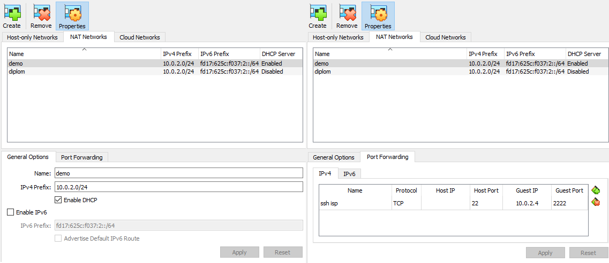

<h1 align="center">DEMO EXAM </h1>
<h3 align="center">this repo contains all source configs for demonstration exam</h3>

based on https://sysahelper.ru/course/view.php?id=10#section-0

 
 
<h3 align="center">================== ALT-LINUX VERSION ==================</h3>
 

<b>AUTO CONFIGURE HOST:</b>

clone repo to linux machine:

<code>apt install git make; git clone https://github.com/Ivashkka/demo_exam.git; cd demo_exam</code>

start autoconfigure script:

<code>make install</code>

host will be rebooted

 

<b>all apt package requirements:</b>

<pre>net-tools
bind-utils
nftables
</pre>

you can run <code>apt install < apt_requirements.txt</code> to install all at once

 

<b>network topology</b>

 
 

<b>VirtualBox network configuration</b>

 
 

<b>Vms network configuration</b>

 
 

<b>ISP-HQ-R iperf3 results</b>

 

<b>source_cfg tree:</b>

<pre>
source_cfg/
├── BR-R
│   └── empty.txt
├── BR-R-req.txt
├── BR-SRV
│   └── empty.txt
├── BR-SRV-req.txt
├── CLI
│   └── empty.txt
├── CLI-req.txt
├── HQ-R
│   └── empty.txt
├── HQ-R-req.txt
├── HQ-SRV
│   └── empty.txt
├── HQ-SRV-req.txt
├── ISP
│   └── empty.txt
└── ISP-req.txt
</pre>
 

**Finished modules:**
- [ ] Module 1:
  - [ ] 1.1 VirtualBox adapters + vms interface configurations
  - [ ] 1.2 IPSec / GRE ipv4 tunnel + OSPFV2 / OSPFV3
  - [ ] 1.3 Internal DHCP + DHCP6 on HQ-R
  - [ ] 1.4 Local Users
  - [ ] 1.5 iperf3 results
  - [ ] 1.6 /etc backup scripts
  - [ ] 1.7 SSH setup
  - [ ] 1.8 nftables inet filter
- [ ] Module 2:
  - [ ] 2.0 nftables NAT
  - [ ] 2.1 bind9 setup
  - [ ] 2.2 NTP setup
  - [ ] 2.3 Samba domain
  - [ ] 2.4 NFS/SMB
  - [ ] 2.5 LAMP stack
  - [ ] 2.6 MediaWiki + docker
- [ ] Module 3
qwer
