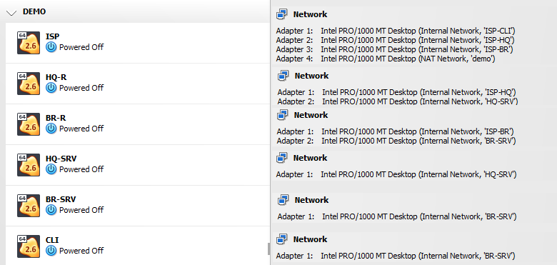

<h1 align="center">DEMO EXAM </h1>
<h3 align="center">this repo contains all source configs for demonstration exam</h3>

based on https://sysahelper.ru/course/view.php?id=10#section-0

 
 

<b>clone</b> repo to linux machine:

<code>apt install git; git clone https://github.com/Ivashkka/demo_exam.git</code>

 

<b>apt package requirements:</b>

<pre>net-tools
openssh-server
tcpdump
vim
screen
frr
strongswan
isc-dhcp-server
isc-dhcp-common
radvd
iperf3
</pre>

you can run <code>apt install < apt_requirements.txt</code> to install all at once

 

<b>network topology</b>

 
 

<b>VirtualBox network configuration</b>

 
 

<b>Vms network configuration</b>

 
 

<b>ISP-HQ-R iperf3 results</b>

 

<b>source_cfg tree:</b>

<pre>
source_cfg/
├── BR-R
│   ├── etc
│   │   ├── frr
│   │   │   ├── daemons
│   │   │   └── frr.conf
│   │   ├── gai.conf
│   │   ├── group
│   │   ├── ipsec.conf
│   │   ├── ipsec.secrets
│   │   ├── modules
│   │   ├── network
│   │   │   └── interfaces
│   │   ├── nftables.conf
│   │   ├── passwd
│   │   ├── ssh
│   │   │   └── sshd_config
│   │   ├── sysctl.conf
│   │   └── systemd
│   │       └── system
│   │           ├── etc_bckp.service
│   │           └── etc_bckp.timer
│   └── root
│       ├── .bashrc
│       └── etc_bckp.sh
├── BR-SRV
│   ├── etc
│   │   ├── gai.conf
│   │   ├── group
│   │   ├── network
│   │   │   └── interfaces
│   │   ├── passwd
│   │   └── ssh
│   │       └── sshd_config
│   └── root
│       └── .bashrc
├── CLI
│   ├── etc
│   │   ├── gai.conf
│   │   ├── group
│   │   ├── network
│   │   │   └── interfaces
│   │   ├── passwd
│   │   └── ssh
│   │       └── sshd_config
│   └── root
│       └── .bashrc
├── HQ-R
│   ├── etc
│   │   ├── default
│   │   │   └── isc-dhcp-server
│   │   ├── dhcp
│   │   │   ├── dhcpd6.conf
│   │   │   └── dhcpd.conf
│   │   ├── frr
│   │   │   ├── daemons
│   │   │   └── frr.conf
│   │   ├── gai.conf
│   │   ├── group
│   │   ├── ipsec.conf
│   │   ├── ipsec.secrets
│   │   ├── modules
│   │   ├── network
│   │   │   └── interfaces
│   │   ├── nftables.conf
│   │   ├── passwd
│   │   ├── radvd.conf
│   │   ├── ssh
│   │   │   └── sshd_config
│   │   ├── sysctl.conf
│   │   └── systemd
│   │       └── system
│   │           ├── etc_bckp.service
│   │           └── etc_bckp.timer
│   └── root
│       ├── .bashrc
│       └── etc_bckp.sh
├── HQ-SRV
│   ├── etc
│   │   ├── gai.conf
│   │   ├── group
│   │   ├── network
│   │   │   └── interfaces
│   │   ├── passwd
│   │   └── ssh
│   │       └── sshd_config
│   └── root
│       └── .bashrc
└── ISP
    ├── etc
    │   ├── gai.conf
    │   ├── group
    │   ├── modules
    │   ├── network
    │   │   └── interfaces
    │   ├── nftables.conf
    │   ├── passwd
    │   ├── ssh
    │   │   └── sshd_config
    │   └── sysctl.conf
    └── root
        └── .bashrc
</pre>
 

**Finished modules:**
- [ ] Module 1:
  - [x] 1.1 VirtualBox adapters + vms interface configurations
  - [x] 1.2 IPSec / GRE ipv4 tunnel + OSPFV2 / OSPFV3
  - [ ] 1.3 Internal DHCP + DHCP6 on HQ-R
  - [ ] 1.4 Local Users
  - [ ] 1.5 iperf3 results
  - [ ] 1.6 /etc backup scripts
  - [ ] 1.7 SSH setup
  - [ ] 1.8 nftables inet filter
- [ ] Module 2
- [ ] Module 3
qwer
